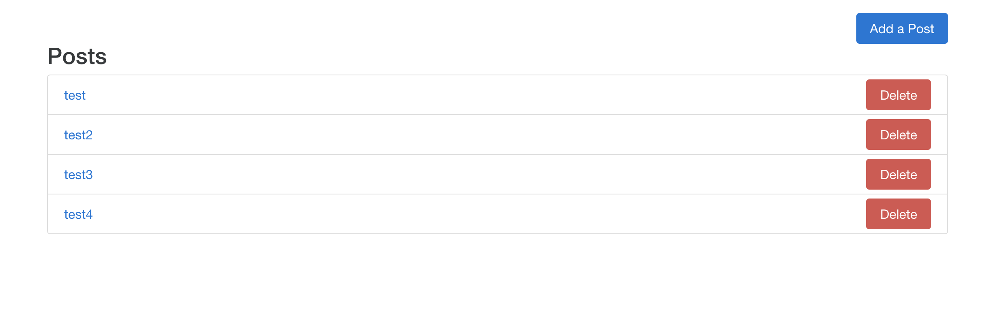
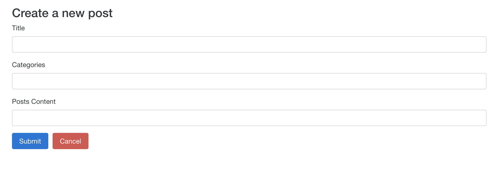
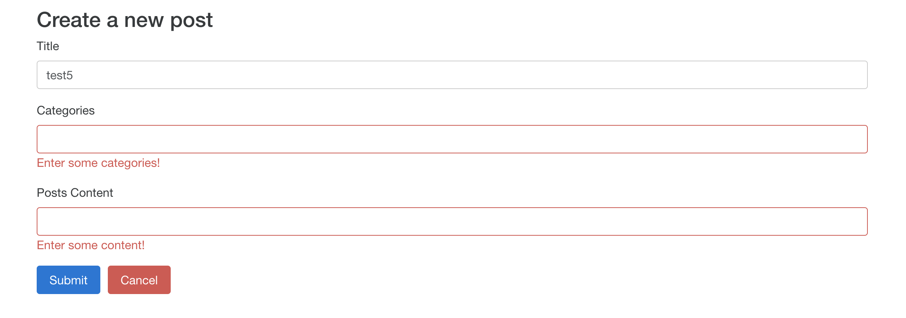

# Blog
This is a blogging web application building with the React and Redux and React Router, etc.
## Getting Started
I used the [Create React App](https://github.com/facebook/create-react-app) to initialize this app.
### Prerequisites
Make sure you have the Node.js installed, after you install the Node, NPM will also be included.
### Clone 
```
git clone https://github.com/Crysisun/Blog.git
```
### Run the app
```
cd Blog
npm start
```
* Open the client at http://localhost:3000/
* The web app will show up, you can select on the existing posts to view what those posts are or delete them:


And you can also add new posts by clicking on the "add a post" button then type in the required fields:


if those fields are left blank, error messages will show up and you can't submit the post until meet the requires:


## Built with
* [React](https://reactjs.org/)
